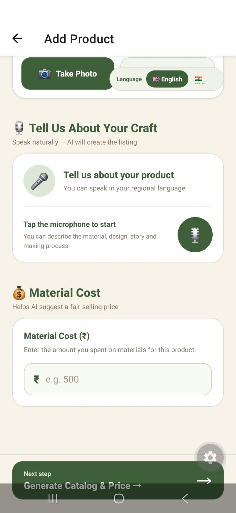

# निर्मितिAI | NirmitiAI

### Turning homemade creations into homegrown businesses 🌿

NirmitiAI is a mobile marketplace designed to help homemakers transform their skills, hobbies, and homemade creations into small home-based businesses. From handmade jewellery and crochet products to homemade snacks, candles, paintings, and gift hampers, the platform aims to make it easier for sellers to showcase their work and reach potential customers.

By combining AI-assisted product cataloguing, image background removal, price suggestions, and a buyer-friendly shopping experience, NirmitiAI aims to make online selling more accessible to people starting their entrepreneurial journey from home.

---
## 🎯 Problem Statement

Homemakers who create products at home often face difficulties when trying to turn
their skills into a small business.

Common challenges include:

- Lack of access to digital marketplaces
- Difficulty creating professional product listings
- Difficulty preparing attractive product photographs
- Lack of knowledge about suitable product pricing
- Difficulty writing product descriptions
- Limited technical knowledge for starting online businesses

NirmitiAI attempts to address these challenges through a simple mobile-first platform.


## 📌 Project Overview

NirmitiAI is a mobile application that connects homemakers who create products at home
with customers looking to discover and purchase homemade products.

The platform combines a marketplace experience with AI-assisted tools that simplify
the process of creating product listings and preparing products for online selling.

The project consists of:

- A React Native + Expo mobile application
- Supabase authentication and database
- A FastAPI backend for AI-assisted features
- A Node.js pricing service for price suggestions


## 🚀 How to Install and Run

### Prerequisites

Install:

- Node.js and npm
- Expo Go
- Python
- A Supabase project

### 1. Clone the Repository

```bash
git clone https://github.com/swaraaa20/NirmitiAI.git
cd NirmitiAI

```

## ✨ Key Features

### 🛍️ Marketplace for Homemakers

* A platform for showcasing and discovering homemade products.
* Product listings with images, names, descriptions, and prices.
* A shopping bag with quantity management and automatic total calculation.
* A checkout interface for reviewing selected products and order totals.

### 📸 AI-Assisted Product Photography

* Upload product images from the device or click new images.
* AI removes image backgrounds to create cleaner product presentations.
* Prepare product images for online catalogues.

### 🎙️ Voice-Based Product Cataloguing

* Record spoken product descriptions.
* Convert recorded speech into text using the backend transcription service.
* Generate product catalogue content from the transcribed description.

### 💰 Smart Price Suggestions

* Connect to a separate pricing service to request suggested product prices.
* prices are suggested based on the making price.
* Help sellers make more informed pricing decisions.

### ✨ Government Support Scheme

* Based on the category of product that homemaker is selling, the amount of loan required and the current situation of business (just started, already started, old business) suggest schemes of the Government that provide loans to help grow the business.

### 🤝 Collaborate with fellow makers

* Enable 'collaborate with other makers', to see near by makers, make collaborative products and create a cohesive business community.

### 📈 Real time analytics

* Get real time analytics of your business, key business insight and suggestion for further growth of your business.

  
### 🔐 Authentication and Data Management

* Supabase integration for authentication and database operations.
* Store and retrieve product information through the configured backend and database.
* Support buyer and seller workflows.

### 🌱 Homemaker-Focused Experience

* A green-and-cream visual theme.
* A simple shopping flow designed around homemade products.
* An interface intended to make digital selling approachable for first-time entrepreneurs.

---

## 🛠️ Tech Stack

| Technology          | Purpose                                 |
| ------------------- | --------------------------------------- |
| React Native        | Mobile application interface            |
| Expo                | Mobile development and testing          |
| TypeScript          | Application logic and type safety       |
| Expo Router         | Screen navigation                       |
| Supabase            | Authentication and database             |
| FastAPI             | Python backend and API endpoints        |
| Node.js             | Separate pricing service                |
| Axios and Fetch API | Frontend-to-backend communication       |
| Pillow and rembg    | Image processing and background removal |

---

## 📱 App Preview




## 🏗️ Project Architecture

NirmitiAI uses a mobile frontend connected to backend services and Supabase.

```text
                 NirmitiAI Mobile App
                React Native + Expo
                         |
          +--------------+--------------+
          |              |              |
     Supabase       FastAPI API    Pricing Service
   Authentication   Python Backend   Node.js
    and Database          |              |
                     +----+----+      Price
                     |         |    Suggestions
                 Image       Voice
                Processing  Transcription
                             and Cataloguing
```

The frontend communicates with the configured services to support product management, AI-assisted content creation, price suggestions, and shopping workflows.

---

## 📁 Project Structure

```text
NirmitiAI/
├── src/
│   ├── app/              # Screens and navigation
│   ├── context/          # Shared application state
│   └── services/         # API and service configuration
├── assets/               # Images and other assets
├── .env                  # Local environment variables
├── app.json              # Expo configuration
├── package.json          # Dependencies and scripts
└── README.md
```

The backend and pricing service are maintained separately from the mobile application.

---
## 🚀 Getting Started

### Prerequisites

- Node.js and npm
- Expo Go
- Python
- A configured Supabase project

### Installation

```bash
git clone https://github.com/swaraaa20/NirmitiAI.git
cd NirmitiAI
npm install

Switch to the development branch:

```bash
git checkout homemaker-marketplace
```


The backend and pricing service must be running for their respective features to work.

---

## 🔮 Future Improvements

Potential areas for further development include:

* Currently is bilingual (English and Hindi) Multilingual product descriptions and regional-language support is a future scope.
* More comprehensive product pricing recommendations.
* Seller order management and order status tracking.
* Production deployment of backend services.
* Improved accessibility for first-time digital entrepreneurs.

---

## 🎯 Vision

NirmitiAI aims to bridge the gap between homemade creativity and digital commerce by giving homemakers tools to present, price, and sell their creations online.

**Every creation deserves a chance to become a business.**

---

## 👩‍💻 Developed With

Built as a student-led project exploring mobile application development, AI-assisted workflows, backend integration, and digital entrepreneurship.

**Project:** NirmitiAI
**Repository:** [github.com/swaraaa20/NirmitiAI](https://github.com/swaraaa20/NirmitiAI)
**Development branch:** `homemaker-marketplace`
